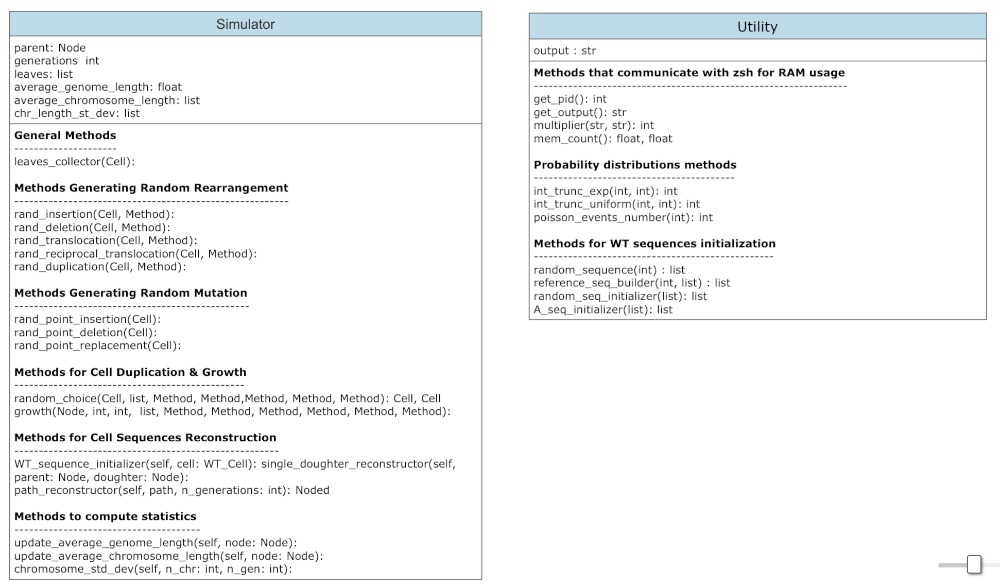
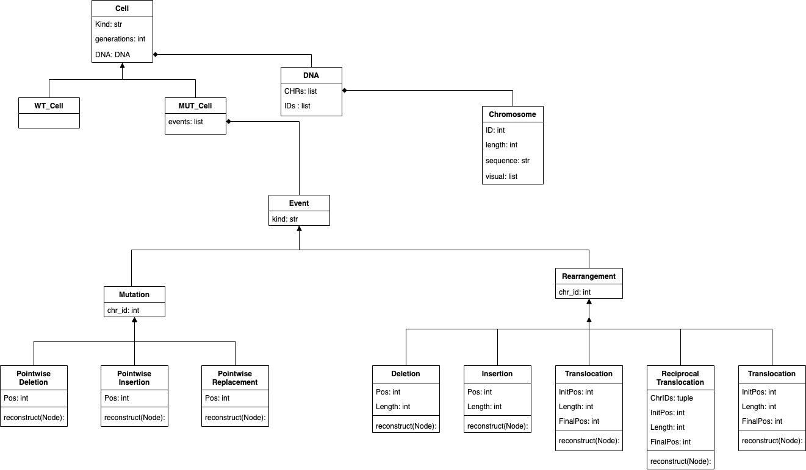
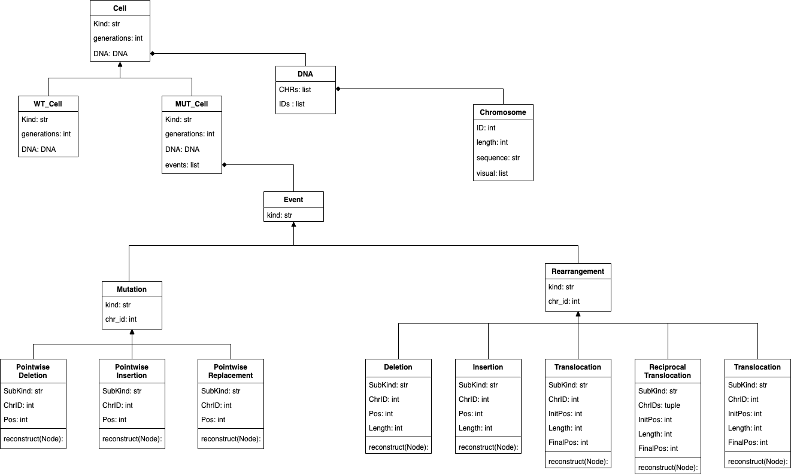

# Yeast-Cascade-Mutation-Simulator
Yeast-Cascade-Mutation-Simulator simulates the duplication of a yeast cell up to a selected number of generations. The duplication process is accompanied by a cascade effect of mutations leading to a broad genomic spectrum at the end of cell growth.
### Motivation:
A single DNA damage event, such as a chromosome breakage in mitosis can be the cause of many mutational processes that occur as a cascade over numerous cell divisions. In addition, the process known as “adaptation to DNA damage” allows cell division despite DNA damages, probably provoking genome instability.

This project is designed to emulate the genome instability results obtained in experiments. Specifically, a single Wild Type yeast cell first suffers irreparable artificial DNA damage and then, through adaptation, begins to divide, producing the cascade effect of mutations mentioned above.

The further goal of the project is to build an algorithm that can reconstruct the history of the cascade process from the genomic spectrum resulting from the experiments. The role of the simulator will be to provide insights into the development of the algorithm and to test its capabilities.

## Table of Contents:
1. Requirements;
2. Installation;
4. Usage;

## 1. Requirements:
This project requires the following libraries:
- Numpy (https://numpy.org);
- copy (https://docs.python.org/3/library/copy.html);

## 2. Installation:
To run the project, simply download the **code** folder. It contains all the necessary files.

## 3. Usage:

### 3.1. Data Structure:
The central structure of the simulation consists of a binary tree. Each node in the tree is thought of as a class containing three attributes: **left**, **right** and **data** (see Binary Tree.py). The first and second attributes are actual nodes and represent the two largest nodes of the parent node. The last attribute **node.data**, contains the corresponding cell.
From the parent node (containing the initial Wild Type cell), all other nodes in the tree can be accessed.

##### Example:
```python 
from Binary Tree import Node

parent = Node() #define the parent node
parent.left, parent.right = Node(), Node() #define the doughter nodes
```

### 3.2. Classes Structure:
In this section I will very quickly explain the structure of the various classes in the project.
The fundamental class is **Cell** which has two subclasses **WT_Cell** (Wild Type) and **MUT_Cell** (Mutated Cell). Both subclasses have an attribute called **DNA**, which is a class in turn containing a list of the different **Chromosomes**.
In addition, only the **MUT_Cell** has as another attribute a list of **Event** representing the mutation events that happened to the respective cell. The **Event** class has two subclasses, the first called **Mutation** is in turn subdivided into: **PointwiseDeletion**, **PointwiseInsertion** and **PointwiseReplacement**. These are mutational events involving a single DNA base.
The other subclass of **Event** is **Rarrangement**, which is divided into:
**Deletion**, **Insertion**, **Translocation**, **TranslocationReciprocation** and **Duplication**. They can involve many DNA bases and more than one chromosome





### 3.3. Structure of the Simulator:
The simulation is divided in two main steps: \
**Step 1 (Simulation)**: effective simulation of the cell divisions; \
**Step 2 (Reconstruction)**: reconstruction of the mutated sequences of the last cell generation or the cell at the end of a selected pathway.
#### 3.3.1. Step 1 (Simulation):
In this step we start with a Wild Type cell. After initializing the class according to the given parameters, we simulate its division up to the selected number of generations. For each cell division we randomly extract the number and types of mutational events occurring in the respective two daughters (during the considered division). The events will be stored in the attribute: **MUT_Cell.events**.
##### Example:
In this example we consider a WT cell with two chromosomes and a two-generation simulation.
```python 
from Simulator import Simulator
from Utility import Utility

# number of generations to be simulated
number_of_generations = 2 

# randomly initialize the chromosomes and their sequences
chromosome_lengths = [int(5e4), int(6e4)] # list containing the lengths of the chromosomes
chromosome_table = Utility.random_seq_initializer(chromosome_lengths) #creates a list containing one tuple (ID, sequence) for each chromosome

# Step 1 (Simulation)
simul = Simulator(chromosome_table, number_of_generations)
# access the parent node and all nodes in the tree
print(simul.parent.data) # WT cell
print(simul.parent.left) # left daughter of the first generation
print(simul.parent.left.right) # and so on ...
```

#### 3.3.2. Step 2 (Reconstruction):
After **Step 1**, a binary tree is obtained that stores at each node the events that occurred in the corresponding cell between the previous and the next division. The purpose of **Step 2** is to use the event lists to reconstruct the DNA sequences that actually mutated (in the last generation of cells) from the Wild Type.

##### Example 1 (Complete Reconstruction):
The following example shows how all cells of the last generation are reconstructed.
```python 
from Simulator import Simulator
from Utility import Utility

# Step 1 (Simulation)
number_of_generations = 2 
chromosome_lengths = [int(20), int(20)] 
chromosome_table = Utility.random_seq_initializer(chromosome_lengths)
simul = Simulator(chromosome_table, number_of_generations)

# Step 2 (Reconstruction)
simul.reconstructor(simul.parent, number_of_generations, chromosome_table) # reconstructs last generation
print(f"CHR1,  WT: {chromosome_table[0][1]}")
print(f"CHR1, MUT: {simul.parent.left.right.data.DNA.CHRs[0].sequence}")
```

##### Example 2 (Path Reconstruction):
In this example, only the leaf corresponding to the given path was reconstructed. Note that in the path: \
0 = left doughter \
1 = right doughter 

```python 
from Simulator import Simulator
from Utility import Utility

# Step 1 (Simulation)
number_of_generations = 2 
chromosome_lengths = [int(20), int(20)] 
chromosome_table = Utility.random_seq_initializer(chromosome_lengths)
simul = Simulator(chromosome_table, number_of_generations)

# Step 2 (Reconstruction)
path = [0, 1] # select the path
leaf = simul.path_reconstructor(path, chromosome_table) #reconstruction of the leaf corresponding to the selected path
print(f"CHR1,  WT: {chromosome_table[0][1]}")
print(f"CHR1, leaf: {leaf.data.DNA.CHRs[0].sequence}")
```

### 3.4. Parameters of the Simulator:
 - **chromosome_table**: List of chromosome sequences with their respective chromosome ID. Each element in the list is a tuple;
 - **number_of_generations**: represents the number of generations you want to simulate in **Step 1**;
 - **average_events_number**: average number of events occurring in a cell during duplication;
 - **cumulative_list**: list containing the values of the cumulative distribution of the event type;
 - **n_events_distrib**: probability distribution of the number of events (default: Poisson distribution);
 - **del_len_distrib**: probability distribution of the Deletion length;
 - **ins_len_distrib**: probability distribution of the Insertion length;
 - **transl_len_distrib**: probability distribution of the Translocation length;
 - **rec_transl_len_distrib**: probability distribution of the Reciprocal Translocation length;
 - **dupl_len_distrib**: probability distribution of the Duplication length;

 **Note**: the probability distributions of the Rearrangements length can be chosen between: discrete truncated uniform and discrete truncated exponential. In the last case it is possible to choose the parameter $\tau$ of the truncated exponential distribution: $p(n) = \frac{1}{Z}\frac{1}{\tau} \cdot e^{-\frac{n}{\tau}}$ where $Z = e^{-\frac{a}{\tau}} - e^{-\frac{b}{\tau}}$. Truncated in the interval $[a,b]$.
 
 In case the **chromosome_table** is not given (see "Utility Class"):
 - **chromosome_lengths**: ordered list containing the lengths of the chromosomes considered;
 - **chromosome_number**: total number of chromosomes considered;

 ### 3.5. Utility Class:
Utility is a class that contains several useful methods: some for testing process RAM usage, others that define probability distributions, and still others that help build a random **chromosome_table** (see "Parameters").

### 3.5.1. Methods for RAM usage:
These methods are useful for calculating RAM usage during simulation. It is important to note that they were written to communicate with macOS zsh and to identify the process ID (pid) of "python3.8". They can be easily adapted for use with another operating system and another version of python.

### 3.5.2. Probability Distributions Methods:
These methods implement probability distributions and can be passed as a parameter to the simulation. The first two (**int_trunc_exp**, **int_trunc_uniform**) use the inverse cumulative method to draw the number of events from truncated distributions, while the last one draws the number of events from a Poisson distribution.

### 3.5.3. Methods Chromosome Sequences Initialization
The role of these methods is to create a random **chromosomal_table** (see Parameters) when it cannot be given from outside.

##### Example:
Here we first initialize a **chromosome_table** in which each chromosome sequence consists of only the 'A' base; and then we create a random one.

```python
from Utility import Utility

chromosome_lengths = [int(5e4), int(4e4)] 

# Only 'A' base
A_chromosome_table = Utility.A_seq_initializer(chromosome_lengths)
# random sequences
random_chromosome_table = Utility.random_seq_initializer(chromosome_lengths)
```