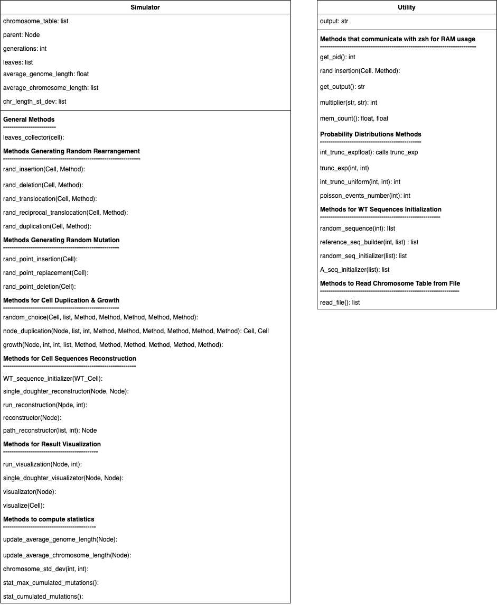

# Yeast-Cascade-Mutation-Simulator
Yeast-Cascade-Mutation-Simulator simulates the duplication of a yeast cell up to a selected number of generations. The duplication process is accompanied by a cascade effect of mutations leading to a broad genomic spectrum at the end of cell growth.
### Motivation:
A single DNA damage event, such as a chromosome breakage in mitosis can be the cause of many mutational processes that occur as a cascade over numerous cell divisions. In addition, the process known as “adaptation to DNA damage” allows cell division despite DNA damages, probably provoking genome instability.

This project is designed to emulate the genome instability results obtained in experiments. Specifically, a single Wild Type yeast cell first suffers irreparable artificial DNA damage and then, through adaptation, begins to divide, producing the cascade effect of mutations mentioned above.

The further goal of the project is to build an algorithm that can reconstruct the history of the cascade process from the genomic spectrum resulting from the experiments. The role of the simulator will be to provide insights into the development of the algorithm and to test its capabilities.

## Table of Contents:
- Requirements;
- Installation;
- Usage;

## Requirements:
This project requires the following libraries:
- Numpy (https://numpy.org);
- copy (https://docs.python.org/3/library/copy.html);

## Installation:
To run the project, simply download the **code** folder. It contains all the necessary files.git

## Usage:

### Data Structure:
The central structure of the simulation consists of a binary tree. Each node in the tree is thought of as a class containing three attributes: **left**, **right** and **data** (see Binary Tree.py). The first and second attributes are actual nodes and represent the two largest nodes of the parent node. The last attribute **node.data**, contains the corresponding cell.
From the parent node (containing the initial Wild Type cell), all other nodes in the tree can be accessed.

##### Example:
```python 
from Binary Tree import Node

parent = Node() #define the parent node
parent.left, parent.right = Node(), Node() #define the doughter nodes
```

### Classes Structure:
In this section I will very quickly explain the structure of the various classes in the project.
The fundamental class is **Cell** which has two subclasses **WT_Cell** (Wild Type) and **MUT_Cell** (Mutated Cell). Both subclasses have an attribute called **DNA**, which is a class in turn containing a list of the different **Chromosomes**.
In addition, only the **MUT_Cell** has as another attribute a list of **Event** representing the mutation events that happened to the respective cell. The **Event** class has two subclasses, the first called **Mutation** is in turn subdivided into: **PointwiseDeletion**, **PointwiseInsertion** and **PointwiseReplacement**. These are mutational events involving a single DNA base.
The other subclass of **Event** is **Rarrangement**, which is divided into:
**Deletion**, **Insertion**, **Translocation**, **TranslocationReciprocation** and **Duplication**. They can involve many DNA bases and more than one chromosome




### Structure of the Simulator:
The simulation is divided in two main steps: \
**Step 1 (Simulation)**: effective simulation of the cell divisions; \
**Step 2 (Reconstruction)**: reconstruction of the mutated sequences of the last generation of cells, or of the cell at the end of a selected path.
#### Step 1 (Simulation):
In this step we start from one Wild Type cell. After the initialization of the class according to the given parameters, we simulate its division up to the selected number of generations. For each cell division we randomly extract the number and the kinds of mutational events occurring in the respective two doughters (during the considered division). The events which will be stored in the attribute: **MUT_Cell.events**.
##### Example:
In this example we consider a WT cell with two chromosome, and a simulation of two generations.
```python 
from Simulator import Simulator
from Utility import Utility

# number of generations to be simulated
number_of_generations = 2 
# randomly initialize the chromosome and their sequences
chromosome_lengths = [int(5e4), int(6e4)] # list containing the lengths of the chromosome
chromosome_table = Utility.random_seq_initializer(chromosome_lengths)
# Step 1 (Simulation)
simul = Simulator(chromosome_table, number_of_generations)
# access parent node and all the tree
print(simul.parent.data) # WT cell
print(simul.parent.left) # first generation left doughter
print(simul.parent.left.right) # and so on...
```

#### Step 2 (Reconstruction):
After **Step 1**, we end up with a binary tree which stores in each node, the events occurred in the corresponding cell between the previous division and the successive one. The aim of **Step 2** is to use the lists of events to reconstruct the actual DNA sequences (in the last generation cells), which are mutated with respect to the Wild Type.

##### Example 1 (Complete Reconstruction):
In this example the last generation is completely reconstructed.
```python 
from Simulator import Simulator
from Utility import Utility

# Step 1 (Simulation)
number_of_generations = 2 
chromosome_lengths = [int(20), int(20)] 
chromosome_table = Utility.random_seq_initializer(chromosome_lengths)
simul = Simulator(chromosome_table, number_of_generations)
# Step 2 (Reconstruction)
simul.reconstructor(simul.parent, number_of_generations, chromosome_table) # reconstruct last generation
print(f"CHR1,  WT: {chromosome_table[0][1]}")
print(f"CHR1, MUT: {simul.parent.left.right.data.DNA.CHRs[0].sequence}")
```

##### Example 2 (Path Reconstruction):
In this example only the leaf corresponding to the given path has been reconstructed. Notice that in the path: \
0 = left doughter \
1 = right doughter 

```python 
from Simulator import Simulator
from Utility import Utility

# Step 1 (Simulation)
number_of_generations = 2 
chromosome_lengths = [int(20), int(20)] 
chromosome_table = Utility.random_seq_initializer(chromosome_lengths)
simul = Simulator(chromosome_table, number_of_generations)
# Step 2 (Reconstruction)
path = [0, 1] # select the path
leaf = simul.path_reconstructor(path, chromosome_table) #reconstruction of the selected leaf
print(f"CHR1,  WT: {chromosome_table[0][1]}")
print(f"CHR1, leaf: {leaf.data.DNA.CHRs[0].sequence}")
```

### Parameters of the Simulator:
 - **chromosome_table**: list of the chromosomes sequences with the respective chromosome ID. Each element of the list is a tuple;
 - **number_of_generations**: represents the number of generations we want to simulate in **Step 1**;
 - **average_events_number**: average number of events occuring in one cell during the duplication;
 - **cumulative_list**: list containing the values of the cumulative distributions of the kind of event;
 - **n_events_distrib**: probability distribution of the number of events (default Poisson);
 - **del_len_distrib**: probability distribution of the deletion length;
 - **ins_len_distrib**: probability distribution of the insertion length;
 - **transl_len_distrib**: probability distribution of the translocation length;
 - **rec_transl_len_distrib**: probability distribution of the reciprocal translocation length;
 - **dupl_len_distrib**: probability distribution of the duplication length;
 
 In case the **chromosome_table** is not given:
 - **chromosome_lengths**: ordered list containing the lengths of the chromosomes considered;
 - **chromosome_number**: total number of chromosomes considered;

 ### Utility Class: