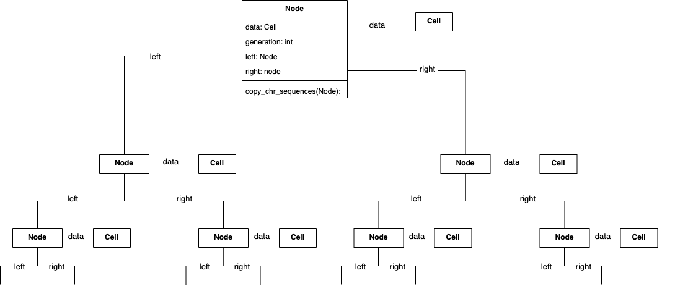

# Yeast-Cascade-Mutation-Simulator
Yeast-Cascade-Mutation-Simulator simulates the duplication of a yeast cell up to a selected number of generations. The duplication process is accompanied by a cascade effect of mutations leading to a broad genomic spectrum at the end of cell growth.
### Motivation:
A single DNA damage event, such as a chromosome breakage in mitosis can be the cause of many mutational processes that occur as a cascade over numerous cell divisions. In addition, the process known as “adaptation to DNA damage” allows cell division despite DNA damages, probably provoking genome instability.

This project is designed to emulate the genome instability results obtained in experiments. Specifically, a single Wild Type yeast cell first suffers irreparable artificial DNA damage and then, through adaptation, begins to divide, producing the cascade effect of mutations mentioned above.

<!---
The further goal of the project is to build an algorithm that can reconstruct the history of the cascade process from the genomic spectrum resulting from the experiments. The role of the simulator will be to provide insights into the development of the algorithm and to test its capabilities.
--->

## Table of Contents:
1. **Requirements**;
2. **Installation**;
3. **Implementation**;
    1. **Node Class**;
    2. **Classes relative to the cell structure**;
    3. **Utility Class**;
    4. **Implementation of the Simulator**;
4. **Usage**;
    1. **Chromosome data format and reading from file**;
    2. **Node and Wild Type Cell**;
    3. **Step 1 - Simulation**;
    4. **Step 2 - Reconstruction**;
    5. **Step 3 - Visualization**;
    6. **Parameters of the Simulator**;
    7. **Usage of Utility Class**;
5. **Notebooks**;
6. **Roadmap**.

## 1. Requirements:
This project requires the following libraries:
- Numpy (https://numpy.org);
- copy (https://docs.python.org/3/library/copy.html);
- matplotlib.pyplot (https://matplotlib.org/3.5.3/api/_as_gen/matplotlib.pyplot.html);
- subprocess (https://docs.python.org/3/library/subprocess.html).

## 2. Installation:
To run the project, simply download the **code** folder. It contains all the necessary files.

## 3. Implementation:

### 3.1. Node Class:
The simulation is implemented on a binary tree structure, in which each node stores a cell and all related information. The node is defined as a class (**Node**) that has three attributes: **left_child**, **right_child** and **data** (see BinaryTree.py). 
The **left_child** and **right_child** attributes are assigned one node each, respectively, and represent the two child nodes of the parent node. The last **data** attribute contains the corresponding cell.
From the parent node (which contains the initial Wild Type cell) all other nodes in the tree can be accessed (see **3.2 Usage**).

### 3.2. Classes related to the cell structure:
In this section I will explain very quickly how the various classes in the project used to collect the information contained in each cell were constructed.
The fundamental class is **Cell** which has two subclasses **WT_Cell** (Wild Type) and **MUT_Cell** (Mutated Cell). Both subclasses have an attribute called **DNA**, which is a class in turn containing a list of the different **Chromosomes**.
In addition, only the **MUT_Cell** has as another attribute a list of **Event** that represent the mutation events that happened to the respective cell in its cycle. The **Event** class has two subclasses, the first called **Mutation** is in turn subdivided into: **PointwiseDeletion**, **PointwiseInsertion** and **PointwiseReplacement**. These are mutational events involving a single DNA base.
The other subclass of **Event** is **Rarrangement**, which is divided into:
**Deletion**, **Insertion**, **Translocation**, **TranslocationReciprocation** and **Duplication**. They can involve many DNA bases and more than one chromosome.

### 3.3. Utility Class:
The **Utility** class contains several methods needed for both simulation and testing: methods that communicate with zsh for RAM usage, methods for probability distributions, for initializing WT sequences, and for reading from files.


### 3.4. Simulator Implementation:
The simulation is accessed through the **Simulator** class and is divided as follows: \
**Step 1 (Simulation)**: actual simulation of cell divisions; \
**Step 2 (Reconstruction)**: reconstruction of the mutated sequences of the last cell generation or just the cell at the end of a selected pathway;
**Step 3 (Visualization)**: here the information gathered during **Step 1** is used to display (for each chromosome of the last cell generation) the number of *"cumulated mutations/rearrangements"*.

#### 3.4.1. Step 1 (Simulation):
In this step we initialize a Wild Type cell (class **WT_Cell**) and a node (class **Node**). After initializing the cell according to the given parameters, we assign it to the node. The node will be the root of the binary tree. Then we simulate cell division up to the selected number of generations. For each cell division two child nodes will be created, which will in turn contain the two daughter cells. After each cell division we randomly extract the number of mutations/rearrangements (from a Poisson distribution, by default) that occurred in the two daughter cells, respectively. For each mutational event we then extract its type (based on weights) from the possible ones: **Deletion**, **Insertion**, **Translocation**, **Substitution**, **Duplication**, **Deletion of points**, **Insertion of points** and **Substitution of points**. The events will be stored in the attribute: **MUT_Cell.events**.
After **Step 1**, you get a binary tree that stores in each node the events that occurred in the corresponding cell between the previous and the next division.

#### 3.4.2. Step 2 (Reconstruction):
The purpose of **Step 2** is to use the event lists collected in **Step 1** to reconstruct the DNA sequences that have actually mutated (in the last generation of cells) from the Wild Type.
This process is performed recursively starting from the root node, using the contained WT cell to reconstruct the two daughters and repeating the procedure until the last generation of cells.

#### 3.4.3. Step 3 (Data Visualization):
The purpose of **Step 3** is to provide a representation of the number of *"cumulative mutations/rearrangements"* in each sequence. The process takes place recursively as in **Step 2** starting from the root and expanding to the leaves. The data visualization is to highlight the positions of the resulting chromosomes that have undergone the most rearrangements/mutations, as can be seen in the image below:


The implementation of this *"process for visualization "* is done as follows. Each chromosome in the WT cell is assigned an array of zeros (called **visual**) of the same length as its sequence. Following the hierarchy of cell duplications, this array is changed in its length according to the mutations/rearrangements that have occurred and, at the positions where an event has occurred, the value of the entries is increased by one.
Eventually, an array is obtained for each chromosome, where the larger the value of the entry, the higher the number of cumulative events at that position.

#### Simulator & Utility classes:

#### Cells, DNA & events classes:

#### Binary tree classes:


## 4. Usage:

### 4.1. Chromosome data format and reading from file:
The **Simulator** takes as input WT chromosome sequences in the following format called **chromosome table**: a list of tuples, ordered from the first chromosome to the last. Each tuple consists of two entries: (chromosome ID: int, DNA sequence: str).

#### 4.1.1. Reading from file:
You can provide the **Simulator** with the **chromosome_table** by reading it from an external file. The read file (**chromosome_list.txt**) must be a txt file that contains a DNA sequence of the corresponding chromosome for each raw..

##### Example (reading from file):
```python 
import sys
sys.path.insert(1, '../code') 
from Utility import Utility
# Read the file "chromosme_list.txt" and initialize the chromosome table"
chromosome_table = Utility.read_file()
```

#### 4.1.2. Initialize Chromosome Table with Random Sequences:
If the chromosome sequences are not provided by an external file, they can be defined randomly through the **Utility.random_seq_initializer** function. This function returns a random_chromosome_table from an array containing the sequence lengths of each chromosome.
```python 
import sys
sys.path.insert(1, '../code') 
from Utility import Utility

chromosome_lengths = [int(5e4), int(45e4), int(4e4)] # lengths of the chromosome sequences (ordered)
chromosome_table = Utility.random_seq_initializer(chromosome_lengths) 
```

### 4.2. Node and Wild Type Cell:
The structure of the binary tree is due to the definition of the class **Node** and the fact that each node has two larger nodes as attributes. The third attribute (**data**) contains the respective cell. 

##### Example (Node and WT cell):
In this example we first initialize the **Node** object 'parent'. Then we define its attributes as two other **Node** objects, and assign a WT cell to the **data** attribute.

```python 
import sys
sys.path.insert(1, '../code') 
from Binary Tree import Node
from Utility import Utility
from WTCell import WT_Cell

parent = Node() # define the parent node
parent.left, parent.right = Node(), Node() # define child nodes
# Initialize the WT cell and assign it to 'parent.data'.
chromosome_table = Utility.read_file()
parent.data = WT_Cell(chromosome_table)
```

### 4.3. Step 1 - Simulation:
The **Step 1** of the simulation is initiated when an object of class **Simulation** is defined. This object will contain many attributes, including the root node of the binary tree, from which the entire tree is accessible.

##### Example (Step 1 - Simulation):
In this example we consider a WT cell with two chromosomes and a two-generation simulation. Once the object of the **Simulation** class has been initialized, we show how to access to the simulated binary tree.
```python 
import sys
sys.path.insert(1, '../code') 
from Simulator import Simulator
from Utility import Utility

# number of generations to be simulated
number_of_generations = 2 

# randomly initialize the chromosomes and their sequences
chromosome_lengths = [int(5e4), int(6e4)] # list containing the lengths of the chromosomes
chromosome_table = Utility.random_seq_initializer(chromosome_lengths) # creates a list containing a tuple (ID, sequence) for each chromosome

# Step 1 (Simulation)
simul = Simulator(chromosome_table, number_of_generations, visual=False)
# access the parent node and all nodes in the tree
print(simul.parent.data) # WT cell
print(simul.parent.left) # left daughter of the first generation
print(simul.parent.left.right) # and so on ...
```
### 4.4. Step 2 - Reconstruction:
Once the **Simulation** object is initialized, the result is a binary tree containing for each node a cell and the list of mutations/rearrangements that occurred in its cycle. The actual DNA sequence is not yet visible. To see the actual mutated sequence, it is necessary to perform the *"reconstruction process"*. The result of the process is the addition of the mutated sequence to the last generation of cells. These cells are then accessed by the **Simulation.leaves** attribute.

##### Example 1 (Complete Reconstruction):
The following example shows how all cells of the last generation are reconstructed.
```python 
import sys
sys.path.insert(1, '../code') 
from Simulator import Simulator
from Utility import Utility

# Step 1 (Simulation)
number_of_generations = 2 
chromosome_lengths = [int(20), int(20)] 
chromosome_table = Utility.random_seq_initializer(chromosome_lengths)
simul = Simulator(chromosome_table, number_of_generations)

# Step 2 (Reconstruction)
simul.run_reconstruction(simul.parent, number_of_generations) # reconstructs last generation
print(f"CHR1,  WT: {chromosome_table[0][1]}")
print(f"CHR1, MUT: {simul.parent.left.right.data.DNA.CHRs[0].sequence}")
```

Instead of complete reconstruction, only the sequences corresponding to a selected pathway in the cell duplication process can be reconstructed. 

##### Example 2 (Path Reconstruction):
In this example, only the leaf corresponding to the given path was reconstructed. Note that in the path: \
0 = left daughter \
1 = right daughter 

```python 
import sys
sys.path.insert(1, '../code') 
from Simulator import Simulator
from Utility import Utility

# Step 1 (Simulation)
number_of_generations = 2 
chromosome_lengths = [int(20), int(20)] 
chromosome_table = Utility.random_seq_initializer(chromosome_lengths)
simul = Simulator(chromosome_table, number_of_generations)

# Step 2 (Path Reconstruction)
path = [0, 1] # select the path
leaf = simul.path_reconstructor(path) #reconstruction of the leaf corresponding to the selected path
print(f"CHR1,  WT: {chromosome_table[0][1]}")
print(f"CHR1, leaf: {leaf.data.DNA.CHRs[0].sequence}")
```

### 4.5. Step 3 - Visualization:
As in **Step 2**, after initialization of the **Simulation** object, the **visual** arrays are empty. In order to see them, it is necessary to run the *"visualization process"*. The result of the process is the addition of the **visual** arrays to the last generation of cells. These cells are then accessed by the **Simulation.leaves** attribute.

##### Example (Visualization):
The following example shows how to run the *'visualization process'*.
```python 
import sys
sys.path.insert(1, '../code') 
from Simulator import Simulator
from Utility import Utility

# Step 1 (Simulation)
number_of_generations = 5
chromosome_lengths = [int(20), int(20)] 
chromosome_table = Utility.random_seq_initializer(chromosome_lengths)
simul = Simulator(chromosome_table, number_of_generations)

# Step 2 (Visualization)
simul.run_visualization(simul.parent, number_of_generations)
print(f"last generation - CHR1 - visual: {simul.leaves[0].DNA.CHRs[0].visual}")
```

### 4.6. Parameters of the Simulator:
 - **chromosome_table**: List of chromosome sequences with their respective chromosome ID. Each element in the list is a tuple;
 - **number_of_generations**: represents the number of generations you want to simulate in **Step 1**;
 - **average_events_number**: average number of events occurring in a cell during its cycle;
 - **cumulative_list**: list containing the values of the cumulative distribution of the event type;
 - **n_events_distrib**: probability distribution of the number of events (Poisson distribution by default);
 - **del_len_distrib**: probability distribution of the Deletion length;
 - **ins_len_distrib**: probability distribution of the Insertion length;
 - **transl_len_distrib**: probability distribution of the Translocation length;
 - **rec_transl_len_distrib**: probability distribution of the Reciprocal Translocation length;
 - **dupl_len_distrib**: probability distribution of the Duplication length;

**Note**: the probability distributions of the Rearrangements length can be chosen between: **discrete truncated uniform** and **discrete truncated exponential**. In the last case it is possible to choose the parameter $\tau$ of the truncated exponential distribution:\
$p(n) = \frac{1}{Z} \cdot e^{-\frac{n}{\tau}}$  where  $Z = e^{-\frac{a}{\tau}} - e^{-\frac{b}{\tau}}$. Truncated in the interval $[a,b]$.
 
 In case the **chromosome_table** is not given (see "4.1.2. Initialize Chromosome Table with Random Sequences"):
 - **chromosome_lengths**: ordered list containing the lengths of the chromosomes considered;
 - **chromosome_number**: total number of chromosomes considered;

### 4.7. Use of Utility Class:
**Utility** is a class that contains several useful methods: some for testing process RAM usage, others that define probability distributions, and still others that help construct a random **chromosome_table** (see "4.6. Parameters of the Simulator").

### 4.7.1. Methods for RAM usage:
These methods are useful for calculating RAM usage during simulation. It is important to note that they were written to communicate with macOS zsh and to identify the process ID (pid) of "python3.8". They can be easily adapted for use with another operating system and another version of python.

### 4.7.2. Probability Distributions Methods:
These methods implement probability distributions and can be passed as a parameter to the simulation. The first two (**int_trunc_exp**, **int_trunc_uniform**) use the inverse cumulative method to draw the number of events from truncated distributions, while the last one draws the number of events from a Poisson distribution.

### 4.7.3. Methods for Chromosome Sequences Initialization:
The role of these methods is to create a random **chromosome_table** (see "4.6. Parameters of the Simulator") when it cannot be given from outside.

## 5. Notebooks:

### 5.1. Simulation Test:
In this notebook, only the simulator **Step 1** was run. After the simulation, the *initial genome length* was compared with the *average genome length* in the cells of the last generation. In addition, the *average chromosome length* of the last generation and its standard deviation for each of the chromosomes was plotted.
This information can be useful for testing the simulator and comparing it with real experiments.

### 5.2. RAM Usage and Time Elapsed Test:
This notebook is essential to understand both the memory and time required for a complete simulation. The **Step 1** and the *complete reconstruction* of **Step 2** were run for a different number of generations. It is clear from the graphs that both elapsed time and memory grow as a power law of the number of generations. In particular, as expected, it is not difficult to show that they grow as $~2^{n}$ with $n=\text{number of generations}$. 

### 5.3. Path Reconstruction Test:
This test consists of reconstructing the sequences of a given path after the simulation process (**Stage 1**).

### 5.4. Visualization Test:
This test consists of performing the *"visualization process "* of sequences after the simulation process (**Step 1**).

### 5.5. Parameters Test:
The purpose of this test is to understand which parameter ranges distinguish between the regime in which mutations do not overlap (thus easily distinguishable) and the regime in which they do overlap (reconstruction is required).
In this test we run the simulation for different *average numbers of events* and compare the average number of cumulative events.

## 6. Roadmap:
- [x] documentation;
- [x] github repository;
- [x] RAM usage test;
- [x] elapsed time test;
- [x] data and results representation;
- [ ] test of the regimes for different parameters;
- [ ] application to real yeast cells.


# TO DO: 
- [x] create a different function for visualization;
- [x] update documentation of Simulator to consider the previous point;
- [x] check the functions that compute stats for cumulated mutation;
- [x] update documentation of Simulator to consider the previous point;
- [x] check if you can remove the parameter "chromosome_table" when calling "reconstructor()";
- [x] create program to read from file;
- [x] create folder for Jupyter notebooks;
- [x] eliminate repeated attributes in class diagrams;
- [x] rename the Binary Tree file as BinaryTree;
- [x] create chapter "Usage" with all the examples;
- [x] create chapter "Implementation" with class structure, implementation of the Simulator etc.. ;
- [x] create chapter "Notebooks";
- [x] substitute left and right with left_child & right_child in the code;
- [x] check the grammar of the readme;